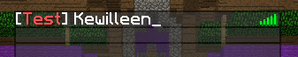

# TabsTag
[](https://app.codacy.com/manual/Kewilleen/TabsTag?utm_source=github.com&utm_medium=referral&utm_content=Kewilleen/TabsTag&utm_campaign=Badge_Grade_Dashboard)
[](https://travis-ci.org/Kewilleen/TabsTag)

A simple plugin that allows players to have a tag on the tablist, tag on the player's head and I added the health icon below the nickname

## Summary
  * [System requirements](#system-requirements)
  * [Getting started](#getting-started)
    * [Configuration](#configuration)
  * [Events](#events)
    

## System requirements
To run it is necessary that you have the following contents installed:
* [JRE](https://www.java.com/pt_BR/download/) 8 or higher.

## Getting-started
Add the plugin in your server/ folder and use permission tabstag.<tag> to give player access
In the setup, you'll see the tags and their formats

### Configuration
```yaml
Tags:
  #default is to any player
  default: "&r"
  #add tags creating below it
  vip: "&e"
  #to remove, just keep it empty
```

## Events
If you want developer a plugin and need tag in tab, use it. I create an [example](example/plugin-example) to get tag from [SimpleClans](https://github.com/marcelo-mason/SimpleClans)

```
PlayerSetTagEvent -> set your tag
PlayerRemoveTagEvent -> remove tag
```

#### Simple examples
 
Usign [PlayerSetTagEvent:](https://kewilleen.github.io/TabsTag/me/kewi/api/PlayerSetTagEvent.html)
```java
@EventHandler
private void onSetTag(PlayerSetTagEvent event) {
    if (event.getPlayer().getName().equalsIgnoreCase("yourname"))
        event.setTag("§r[§cTest§r]");
}
```
In this example I created a plugin with SimpleClans, so I had the tag automatically

Tablist:\


Player's head:\

